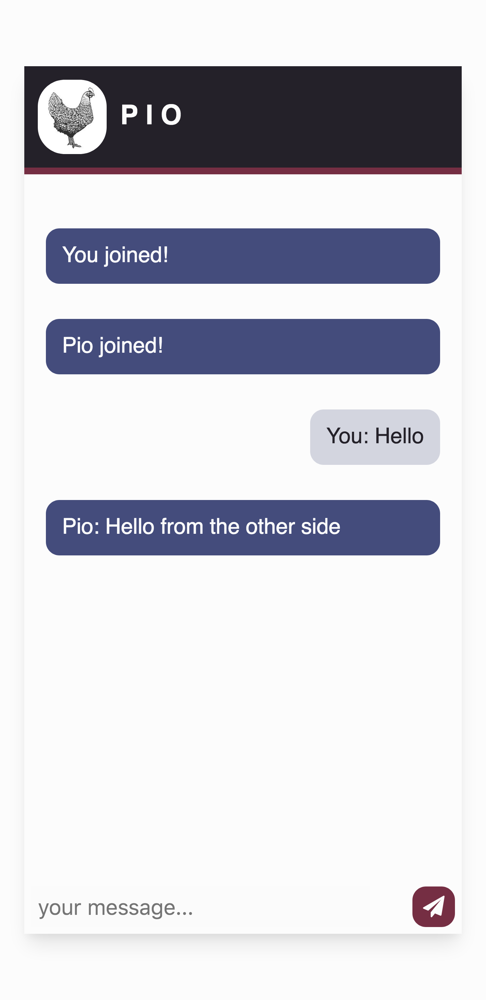

# Socket-io. Chat example

  

This is my first Socket-io chat. It's based on the example given by Socket-io in [official website](https://socket.io/get-started/chat/)

:rocket: See the online version at [Heroku](https://pio-socketchat.herokuapp.com/)

## What is it about?

It's a simple, minimal designed chat to practice some notions about server & client apps. Only text is allowed. You can select a user name, see when somebody join or disconnect the chat and fits nicely on mobile.

## To run locally:

Download or clone this repo, install dependencies and launch the app with `npm run devStart`. This is for listening any changes on the code, but you can use `node server.js`instead.

